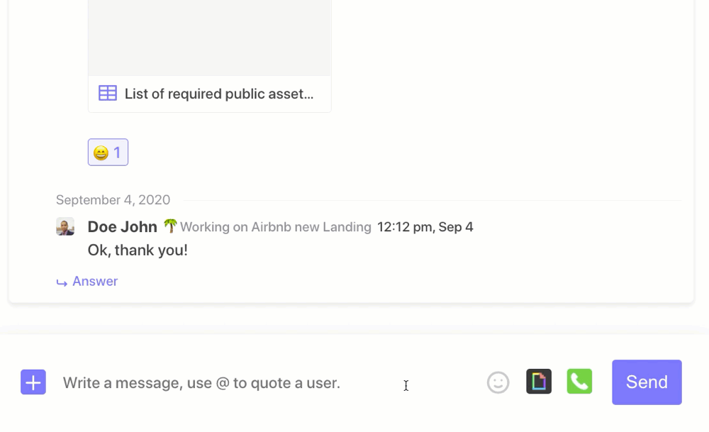

# Chat

The discussion application  are Twake's entry points. This is where you communicate with your team.





## Channels

### Create a channel

To create a channel, you must have `Administrator` rights for the workspace in question. 



To create your channel, click on the `+` button right to the "Channel" inscription. Fill a name for your channel, select a wonderful emoji and select if it is a public or private channel \(by default, channels are private\).

### Channel sections

You can organize your channel by grouping them. If you are `Administrator`, you can drag a channel and drop in the section you want `Add here` or in `New group`. 

To edit section name, you just have to click on it, change the name and press `Enter`

### Public channel

Public channels are visible to all members of the workspace.

### Private channel

Private channels are channels accessible only to a limited number of users. Members not present in these channels cannot see them.

#### Modify the members of a private channel

You can choose the members of a private channel when creating it. To modify the members of a private channel once created, place your mouse on the channel, click on the `...` then on `Edit channel`, in the `Participants` box, you can add or remove the members of the channel.

### External member

You have the possibility to invite external members to your channel. External members are members who are not in the workspace and who are added to one, or more,  specific channel\(s\). 

This feature is useful for inviting users who are not in your company. Freelancers, for example, can be added to a specific channel to collaborate on a project. They will only have access to this channel, they will not see public channels.

### Mute a channel

You can mute a channel so that you do not receive notification of it. You will not receive a new notification from that channel unless you are mentioned \(with @username\). To do it, click on `...` and `Mute`a barred bell icon will appear.

### Star a channel

If a channel is very important for you, you can star it. Stared channels are gathered at the top of your channel. It is only for your view, not for everyone. To star a channel click on `...` and `Star this channel`. Your channel will be move to the stared channel section \(at the top\).

## Message

### Send a message

To send a message, select the channel where you want to post. In the input message, write what you want to send. Press `enter` to send the message.

If you want to add a new line to your message, press `Shift + Enter`.

#### Pin

If one of the message is important for the team, you can pin it \(or unpin\)

#### Reaction

You can react to a message with emoji. Click on the `Emoji button` in message to show emoji picker.

#### Response to a message

Someone ask you a question ? You can answer it by clicking `Answer` below the message.

#### Reorganize your chat

You can reorganize your chat by dragging and dropping your messages. 

#### See thread message

You can see a thread in a specific view. Hover over in one, the button `Show on the right` . A side panel opens.

### Integration

#### Gif 

You can send gif in your channel. Just clic gif icon to open a gif selector.

#### Call

If you need to call your team, there is native integration with Jitsi. Just click on the green button with the phone and a menu opens on the left to create a Jitsi call. Once the information is filled in, the call link is sent to your team.

### Send document

If you want to send a document through the chat, drag it from your computer and drop it into the chat. It will be uploaded and shared with your teammates.

You can also send a document from Twake drive: click on the `+` button, to the left of the input. You can select a file from Twake and share it in the chat room.

