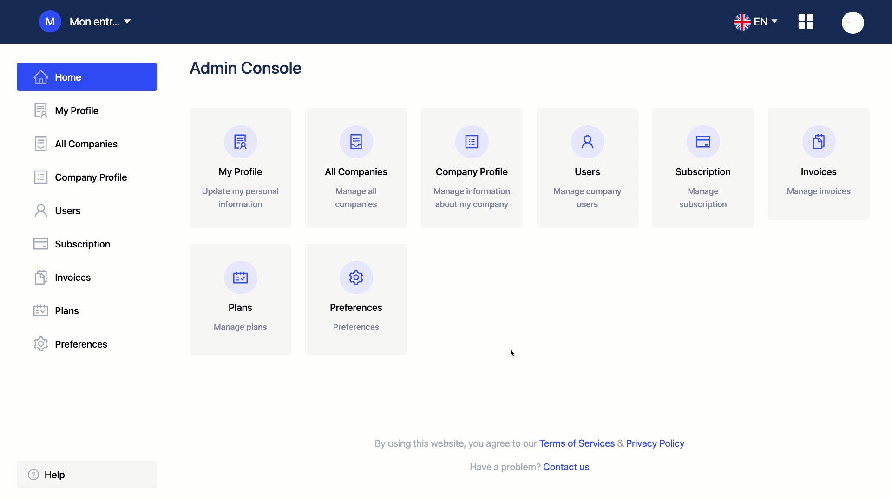

#  Entreprises & Espaces de travail

## Entreprises

Les entreprises (companies en anglais) sont les entités les plus larges sur Twake. Une entreprise est la représentation virtuelle de votre boîte. Vous y trouverez l'ensemble de vos salariés, et des connecteurs que vous avez développés spécifiquement. Les espaces de travail sont des espaces au sein d'une entreprise.

Vous pouvez appartenir à plusieurs entreprises, pour changer d'entreprise, il suffit de cliquer sur le bouton en bas à gauche de l'écran:

//La distinction Entreprise/Espace de travail mériterait d'être complétée pour être plus claire

## Espace de travail

Les espaces de travail (workspace en anglais) représentent les équipes ou les départements de votre organsisation. Chaque espace de travail a ses propres membres, discussions, fichiers, tâches et calendrier. C'est l'espace dans lequel votre équipe collabore.
Les espaces de travail sont listés tout à gauche de l'écran.

## Inviter un utilisateur depuis le Chat

Vous pouvez inviter un utilisateur à partir de votre espace de travail.

Pour ce faire, ouvrez le menu en cliquant sur le nom de l'espace de travail, cliquez sur `Utilisateurs` &gt; `Inviter des utilisateurs`, puis tapez l'email de vos collègues \(séparés par des virgules\) à ajouter à l'espace de travail, puis cliquer sur Ajouter. Vous pouvez aussi générer un lien d'invitation à rejoindre l'espace de travail.

Vous pouvez aussi inviter des utilisateurs à partir de la console, référez-vous à la page dédiée :



# Gestion des droits

Twake support de un définition fine des droits. Chaque utilisateur appartient à un ou plusieurs espaces de travail dans une même entreprise. Ils peuvent par ailleurs avoir différents statuts en fonction de leur appartenance à une entreprise ou un espace de travail.

## Propriétaire (Owner)

Le propriétaire est l'administrateur principale d'une entreprise. Il peut : 

* Permettre l'installation de connecteurs et d'applications dans les espaces de travail
* Changer l'identité de l'entreprise
* Donner et retirer les droits associé au rôle "Propriétaire de l'entreprise" à un membre de cette entreprise

Le créateur de l'entreprise est le seul propriétaire. Ce rôle ne peut être changé, et seulement le créateur peut être le propriétaire de l'entreprise.

//N'est-ce pas contradictoire avec le 3e bullet point ci-dessus?

## Admin

Un admin a les mêmes droits que le propriétaire. Il peut:

* Permettre l'installation de connecteurs et d'applications dans les espaces de travail
* Changer l'identité de l'entreprise
* Donner et retirer les droits associé au rôle "Propriétaire de l'entreprise" à un membre de cette entrepri>

//Il me semble pertinent de revoir ici aussi le 3e bullet point

Pour donner le rôle d'admin, ouvrez la console \([https://console.twake.app](https://console.twake.app)\), dans le menu, ouvrez la section `Membres`, puis cliquer sur `Éditer` sur le membre dont vous souhaitez modifier le rôle et sélectionnez `Admin` avant de sauvegarder.

## Administrateur d'espace de travail

Ce rôle est celui de l'admin de l'équipe. En plus des droits d'un utilisateur classique, il peut:

* Ajouter des membres à l'espace de travail
* Ajouter\/enlever des connecteurs et application de l'espace de travail
* Changer l'identité de l'espace de travail
* Supprimer l'espace de travail

Par défaut, le créateur de l'espace de travail hérite du rôle d'admin de cet espace. Ce rôle peut être cumulé avec celui d'admin de l'entreprise.

Pour donner le rôle d'admin au niveau d'un espace de travai, ouvrez le menu en cliquant sur le nom de l'espace de travail, cliquez sur `Utilisateurs`, ouvrez le menu en bout de ligne du membre souhaité et sélectionnez `Administrateur`.

## Utilisateur

Le rôle d'utilisateur est le rôle par défaut des membres de l'espace de travail. Il peut:

* Lire et envoyer des messages sur les cannaux de chat privés \(ceux auxquels il a été invité\) et publics
* Créer, modifier, supprimer des documents du drive
* Créer, éditer, supprimer des évènement et des calendriers
* Créer, modifier, supprimer des tâches 
//Qu'est-ce que "tables" dans la version anglaise?
* Créer un espace de travail dans l'entreprise

Comme c'est le rôle par défaut, c'est le rôle attribué à tout utilisateur qui n'est ni administrateur de l'entreprise, ni administrateur de l'espace de travail, ni invité.

## Invité

Ce rôle est prévu pour les partenaires externes à l'organisation qui nécessitent un accès à Twake dans le cadre d'un projet ou sujet spécifique. Un utilisteur invité peut:

* Lire et envoyer des messages dans les chaînes auxquelles il a été invité

En tant qu'invité, ils ne peuvent pas rejoindre n'importe quelle chaîne par eux même - même s'il est public. Ils doivent être invités par un utilisateur ayant au moins le droit Utilisateur.

Pour donner le rôle d'invité à un utilisateur, modifiez son rôle dans la console \([https://console.twake.app](https://console.twake.app)\), en passant par la page `Utilisateurs`.

//Nécessaire de préciser ici comment inviter un utilisateur externe avec le statut "Invité" par défaut; nécessaire de l'ajouter d'abord dans la console, puis changer ses droits?

